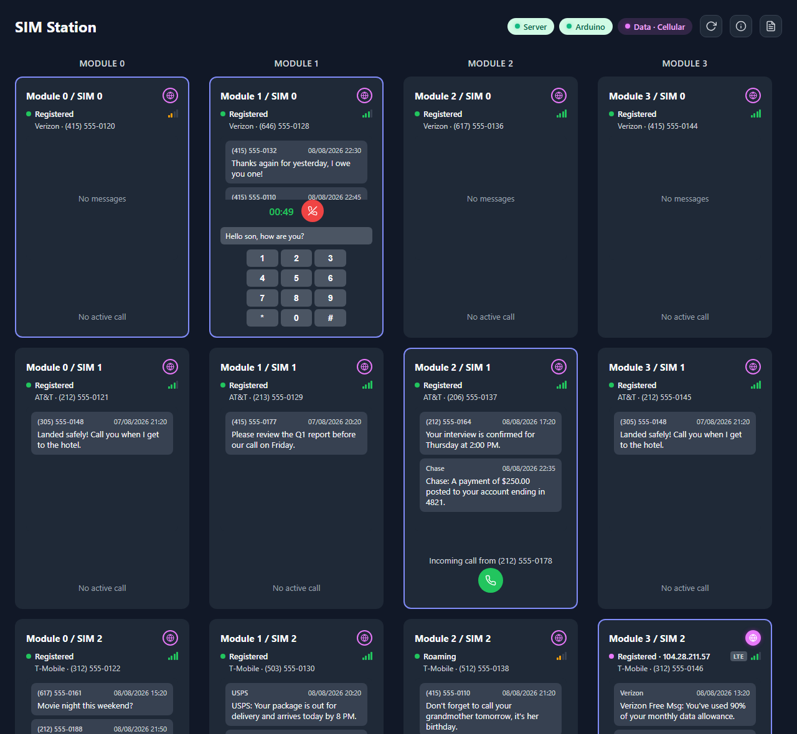
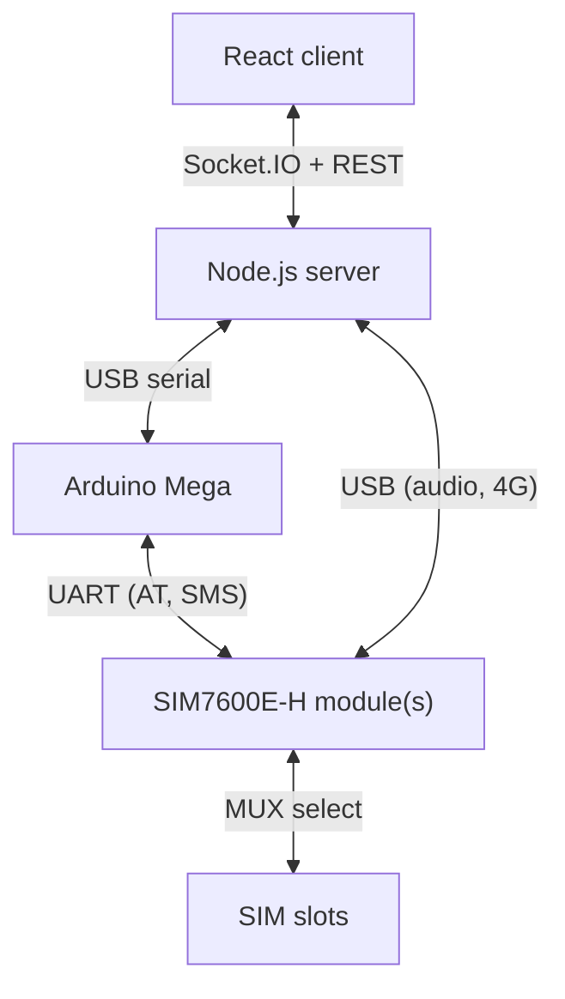

# SIM Station

A self-hosted dashboard for reading SMS and listening to calls on SIM cards you
own, from anywhere. The cards stay in a box plugged into a PC at home; the web
UI lets you read their texts and pick up their calls remotely.

Scope: a tool for operating your own SIM lines remotely (for example, lines you
leave at home while travelling), with a secondary option to route a machine's
internet through one SIM's cellular data.

## Screenshot



<!-- Add docs/hardware.jpg and link it here if you have a hardware photo. -->

## Features

- Read SMS per SIM: stored history plus live incoming messages, UCS2/UTF-8 decoded.
- Answer, hang up, and listen to call audio live in the browser; send DTMF tones.
- Per-SIM status: network registration, operator, signal strength, radio access
  technology, and the SIM's own number (via `AT+CNUM` / USSD).
- One SIM active per module at a time, selected through the MUX, with a
  click-to-select per-module queue and automatic re-selection after the Arduino
  reconnects.
- Optional live call transcription (whisper.cpp server-side, or an in-browser
  Vosk fallback).
- Optional 4G data uplink: make a selected SIM's cellular connection the host's
  default route, and (via a Tailscale exit node) a remote machine's route.
  Windows-only.
- Password authentication with per-IP login rate limiting.
- Module count, SIM slots per module, serial wiring, and MUX pin mapping are
  configuration in `arduino/sim_station/config.h`, not code.

## Hardware requirements

- Arduino Mega 2560 (three hardware UARTs; driving more modules than that uses
  SC16IS750 I2C UART bridges, supported in `config.h`).
- One or more SIM7600E-H modules, one per group of multiplexed SIM slots.
- One 16-channel analog multiplexer (e.g. CD74HC4067) per 16 SIM slots on a
  module, wired onto the module's SIM signal lines.
- SIM sockets and active SIM cards.
- Each module connected to the host by **USB** (AT port + audio + RNDIS) in
  addition to its **UART** to the Arduino.
- [SIM7600X Windows drivers](https://www.waveshare.com/wiki/SIM7600X_Windows_Drive).
- Node.js 18+.

## Installation

Prerequisites: the hardware listed above, Node.js 18+, the Arduino IDE (to flash
the firmware), and the SIM7600X Windows drivers so each module's USB AT and audio
ports enumerate.

1. Flash the Arduino:
   - Open `arduino/sim_station/sim_station.ino` in the Arduino IDE.
   - Edit `arduino/sim_station/config.h` to match your wiring (see
     [Configuration](#configuration)).
   - Upload to the Arduino Mega at 115200 baud.
2. Install the [SIM7600X Windows drivers](https://www.waveshare.com/wiki/SIM7600X_Windows_Drive).
3. Install dependencies:
   ```bash
   cd server && npm install
   cd ../client && npm install
   ```
4. Create the server config from the example, then edit it:
   ```bash
   cd server && cp .env.example .env
   ```
   See [Authentication](#authentication) for `AUTH_PASSWORD`.

## Running

Development (two terminals):

```bash
cd server && npm run dev      # API + serial on :3001
cd client && npm run dev      # Vite dev server on :5173 (proxies to :3001)
```

Production (server serves the built client on :3001):

```bash
cd client && npm run build
cd ../server && npm start
```

On Windows, `start.bat` builds the client and starts the server (it self-elevates
because the optional 4G routing needs administrator rights).

### Authentication

The server has optional password authentication, controlled by `AUTH_PASSWORD` in
`server/.env`. When it is set, every HTTP request and WebSocket connection
requires a session obtained by logging in with that password; the session token
is kept in an httpOnly cookie (7-day expiry) and login is rate-limited to 5
attempts per IP per 15 minutes.

When `AUTH_PASSWORD` is empty (the shipped default in `.env.example`), this
authentication is disabled and the dashboard is open to anyone who can reach it.
The dashboard shows SMS and call contents, so set a long random `AUTH_PASSWORD`
before exposing it beyond localhost.

### Optional: remote access

To reach the dashboard from outside the local network, expose it on a stable
public URL with Tailscale Funnel:

```bash
tailscale up
tailscale funnel --bg 3001
```

The dashboard becomes available at `https://<machine>.<tailnet>.ts.net`. Funnel
publishes it on the public internet, so set `AUTH_PASSWORD` first (see
[Authentication](#authentication)). Stop exposing it with:

```bash
tailscale funnel --https=443 off
```

## Configuration

All hardware layout lives in `arduino/sim_station/config.h`. A module is one
SIM7600 modem plus the MUX(es) that switch its SIM interface between physical
slots. `MODULES[]` declares them; `muxCount` is derived, so you never set it.

```c
// One MUX = { {S0, S1, S2, S3}, EN }.  EN is the enable pin (-1 if unused).
static const MuxPins MUXES_0[] = { { {2, 3, 4, 5}, A9 } };
static const MuxPins MUXES_1[] = { { {6, 7, 8, 9}, A10 } };

// MODULE(sims, muxArray, serialType, i2cAddr, i2cXtalHz)
const ModuleConfig MODULES[] = {
  MODULE(4, MUXES_0, PORT_SERIAL1, 0x00, 0),
  MODULE(4, MUXES_1, PORT_SERIAL2, 0x00, 0),
};
```

The committed configuration is 2 modules × 4 SIMs, but nothing in the code fixes
that. `simCount` is a `uint8_t`, so a module can address up to 255 slots (16 per
multiplexer, set by `CHANNELS_PER_MUX`, with MUXes cascaded), and the firmware
keeps no per-SIM state, so extra slots cost no Arduino RAM. The server and client
are fully topology-driven and impose no SIM limit of their own: the practical
ceiling is how many multiplexer channels and address pins you wire, not the code.

**Example: go from 2 modules to 3.** Add a MUX pin set and one table row on the
third UART:

```c
static const MuxPins MUXES_2[] = { { {10, 11, 12, 13}, A11 } };

const ModuleConfig MODULES[] = {
  MODULE(4, MUXES_0, PORT_SERIAL1, 0x00, 0),
  MODULE(4, MUXES_1, PORT_SERIAL2, 0x00, 0),
  MODULE(4, MUXES_2, PORT_SERIAL3, 0x00, 0),   // added
};
```

The Mega has three hardware UARTs (`PORT_SERIAL1..3`). Beyond three modules, wire
the extra modems to SC16IS750 I2C bridges and use `PORT_I2C` with the bridge's
address and crystal, e.g. `MODULE(4, MUXES_3, PORT_I2C, 0x4B, 14745600)`.

**Example: go from 16 to 32 slots on one module.** List two MUXes; `muxCount`
becomes `ceil(32 / 16) = 2` automatically:

```c
static const MuxPins MUXES_1[] = { { {6,7,8,9}, A10 }, { {22,23,24,25}, A11 } };

  MODULE(32, MUXES_1, PORT_SERIAL2, 0x00, 0),
```

No server or client change is needed: the Arduino reports the new layout via
`TOPOLOGY`, and the dashboard renders whatever it receives.

## Architecture



The Arduino is a transparent passthrough and MUX switcher: it multiplexes each
module's UART, tags responses by module, and toggles MUX address pins on request.
All AT-command parsing and state (SMS decoding, per-SIM registration and call
state, asynchronous URC handling, timers) run in the Node server, not on the
microcontroller. That logic is memory- and iteration-heavy for the Mega's 8 KB
SRAM, and the server already holds a USB connection to each modem for call audio
and 4G, so one process owns all modem I/O. The tradeoff is that every AT exchange
is a USB→Arduino→UART round trip, and the Arduino does nothing without the host.

## Serial protocol

| Direction | Format | Description |
|-----------|--------|-------------|
| Node → Arduino | `TOPOLOGY_REQUEST\n` | Request module/SIM layout |
| Node → Arduino | `MUX:<moduleId>:<simId>\n` | Switch MUX to a SIM slot |
| Node → Arduino | `AT:<moduleId>:<command>\n` | Route an AT command to a module |
| Arduino → Node | `TOPOLOGY:{json}\n` | Module/SIM topology JSON |
| Arduino → Node | `MUX_OK:<moduleId>:<simId>\n` | MUX switch confirmed |
| Arduino → Node | `[<moduleId>]<line>` | AT response line, tagged by module |

Notes from the implementation:

- Responses are line-tagged with `[moduleId]`, so the server can run AT
  operations on several modules in parallel and demultiplex the replies.
- The board resets when the serial port opens, so the server retries
  `TOPOLOGY_REQUEST` until it gets a reply, and re-detects the port on disconnect.
- A SIM switch is a host-side sequence (radio off → MUX switch → radio on → poll
  registration); the wire only carries the `MUX:` request and `MUX_OK`.

## Limitations

- Authentication is optional and off by default: with an empty `AUTH_PASSWORD`
  (the shipped default) the dashboard is unauthenticated. Set it before exposing
  the dashboard, which shows SMS and call contents.
- The 4G data uplink is Windows-only: RNDIS adapter and route management is done
  through PowerShell. SMS and call features are cross-platform.
- Call transcription accuracy is rough on 8 kHz telephony audio, especially the
  in-browser Vosk fallback.
- One SIM per module can be active at a time (the MUX is a switch, not a
  splitter), so switching SIMs briefly cycles the radio.

## License

MIT. See [LICENSE](LICENSE).
